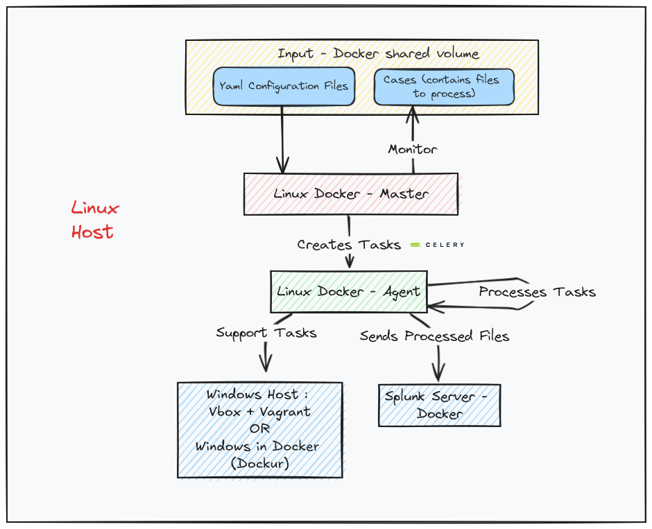

# OSIR

OSIR is a Python project designed for the automated processing of data using modules and profiles. It is primarily aimed at handling forensic artifacts but can be utilized for any type of files. OSIR acts as a scheduler, applying processing tools to files, where the output of some tools can serve as input to others.

OSIR is a dockerized and distributed parsing framework that works on Linux and Windows. The current project supports multiples triages outputs like DFIR ORC and UAC.


# Table of Contents
- [Architecture](#architecture)
- [How does it work ?](#how-does-it-work-)
- [Quick Start](#quick-start)
- [Contributing](#contributing)
- [Main features](#main-features)
- [Documentation](#documentation)
- [Currently supported modules](#currently-supported-modules)
- [Creators](#creators)
- [License](#license)

# Architecture

OSIR can be deployed in several ways, and each component can be externalized.

Here's the default “all in one” configuration:

<p align="center">
  
  
</p>

# How does it work ?

The goal of the tool is to transform input files using processors: **each processor is a module** (decompress archive, convert file to json, SIEM ingestion ...)

Modules are yml files that specify:
- **input** (file or directory) based on its file/directory path and/or name
- **output**: no file (ex: SIEM ingestion), single or multiple files
- **tool used and its command line**: Windows or Linux tool, can even be a Python module
- and other options to discover in the documentation
    
The tool itself is launched with 2 inputs:
- **a case**: directory containing files to process, can containg multiple triages (Windows triages of several endpoints for example)
- **list of modules** used to process the input files

Processing of case (**several cases can be processed in same time**):
- the master contains the case directory and continuously monitors for input that matches the selected modules
- each time a module matches an input, a task is added to the queue (output of a module can be input of another)
- the queue is processed by one or more agent 
- output of modules is written on the master storage


# Quick start

## Clone the project including dependencies

```bash
git clone --recurse-submodules https://github.com/maxspl/OSIR
```

For Ubuntu Symbols autobuild, dwarf2json has to be built using :
```bash
cd OSIR/bin/dwarf2json
go build
```

## Example of usage: parsing DFIR ORC triage on Ubuntu host


# Main features

- Can run on Windows and Linux without any limitation
- Supports any type of input files
- Auto setup of Windows VM (via Windows in Docker or vBox) to use Windows tools on a linux Host
- Can process multiple triages at once 
- Distributed infrastructure: multiple endpoints can connect to distribute the load
- Dockerized installation
- Modular: processing tasks are defined by easily modifiable configuration files
- Splunk integration for output analysis


# Documentation

Project documentation: https://osir.readthedocs.io

# Currently supported modules
| OS        | Filename                             | Description                                                                                | Author       |   Version | Processor Type        | Tool Path                           |
|:----------|:-------------------------------------|:-------------------------------------------------------------------------------------------|:-------------|----------:|:----------------------|:------------------------------------|
|           | prefetch_orc.yml                     |                                                                                            |              |       1   |                       | net6/PECmd.exe                      |
|           | sample_c.yml                         |                                                                                            |              |       1   |                       |                                     |
| all       | thor.yml                             | Scan of collected file using Thor (requires Forensic license).                             |              |       1   | external              | thor/thor-linux-64                  |
| all       | thor_lite.yml                        | Scan of collected file using Thor Lite.                                                    |              |       1   | external              | thor-lite/thor-lite-linux-64        |
| linux     | uac_indexation.yml                   | Splunk ingestion of parsed artifacts                                                       |              |       1   | external              | python                              |
| module_os | sample.yml                           | module_description                                                                         | author_name  |       1   | module_processor_type | module_tool_name                    |
| network   | zeek.yml                             | SParsing of pcap files using zeek                                                          |              |       1   | external              | docker                              |
| unix      | arp.yml                              | Kelly Brazil - JsonConverter - Parsing the output of the command arp or arp -a             |              |       1   | external              | cat                                 |
| unix      | audit.yml                            | Parsing logs from '/var/log/audit'                                                         |              |       1   | internal              |                                     |
| unix      | auth.yml                             | Parsing logs from '/var/log/auth.log'                                                      |              |       1   | internal              |                                     |
| unix      | blkid.yml                            | Kelly Brazil - JsonConverter - Parsing the output of the command blkid                     |              |       1   | external              | cat                                 |
| unix      | bodyfile.yml                         | Parsing logs from '/bodyfile' in UAC collect                                               |              |       1   | internal              |                                     |
| unix      | boot.yml                             | Parsing logs from '/var/log/boot'                                                          |              |       1   | internal              |                                     |
| unix      | cron.yml                             | Parsing logs from '/var/log/cron'                                                          |              |       1   | internal              |                                     |
| unix      | debug.yml                            | Parsing logs from '/var/log/debug'                                                         |              |       1   | internal              |                                     |
| unix      | df.yml                               | Kelly Brazil - JsonConverter - Parsing the output of the command df and df -h              |              |       1   | external              | cat                                 |
| unix      | dmidecode.yml                        | Kelly Brazil - JsonConverter - Parsing the output of the command dmidecode                 |              |       1   | external              | cat                                 |
| unix      | dpkg-l.yml                           | Kelly Brazil - JsonConverter - Parsing the output of the command dpkg -l                   | Kelly Brazil |       1   | external              | cat                                 |
| unix      | dpkg.yml                             | Parsing logs from '/var/log/dpkg'                                                          |              |       1   | internal              |                                     |
| unix      | env.yml                              | Kelly Brazil - JsonConverter - Parsing the output of the command env                       |              |       1   | external              | cat                                 |
| unix      | extract_uac.yml                      |                                                                                            |              |       1   | internal              | tar                                 |
| unix      | findmnt.yml                          | Kelly Brazil - JsonConverter - Parsing the output of the command findmnt                   |              |       1   | external              | cat                                 |
| unix      | free.yml                             | Kelly Brazil - JsonConverter - Parsing the output of the command free                      |              |       1   | external              | cat                                 |
| unix      | ip_route.yml                         | Kelly Brazil - JsonConverter - Parsing the output of the command ip route                  |              |       1   | external              | cat                                 |
| unix      | iptables.yml                         | Kelly Brazil - JsonConverter - Parsing the output of the command iptables                  |              |       1   | external              | cat                                 |
| unix      | journal.yml                          | Parsing logs from '/var/log/journal/'                                                      |              |       1.1 | external              | journalctl                          |
| unix      | kernel.yml                           | Parsing logs from '/var/log/kernel'                                                        |              |       1   | internal              |                                     |
| unix      | last.yml                             | Kelly Brazil - JsonConverter - Parsing the output of the command last and lastb            |              |       1   | external              | cat                                 |
| unix      | lastlog.yml                          | Parsing logs from '/var/log/lastlog'                                                       |              |       1   | internal              |                                     |
| unix      | lsblk.yml                            | Kelly Brazil - JsonConverter - Parsing the output of the command lsblk                     |              |       1   | external              | cat                                 |
| unix      | lsmod.yml                            | Kelly Brazil - JsonConverter - Parsing the output of the command lsmod                     |              |       1   | external              | cat                                 |
| unix      | lsusb.yml                            | Kelly Brazil - JsonConverter - Parsing the output of the command lsusb                     |              |       1   | external              | cat                                 |
| unix      | mail.yml                             | Parsing logs from '/var/log/mail'                                                          |              |       1   | internal              |                                     |
| unix      | message.yml                          | Parsing logs from '/var/log/message'                                                       |              |       1   | internal              |                                     |
| unix      | mount.yml                            | Kelly Brazil - JsonConverter - Parsing the output of the command mount                     |              |       1   | external              | cat                                 |
| unix      | netstat.yml                          | Kelly Brazil - JsonConverter - Parsing the output of the command netstat                   |              |       1   | external              | cat                                 |
| unix      | postgresql.yml                       | Parsing logs from '/var/log/postgresql'                                                    |              |       1   | internal              |                                     |
| unix      | ps.yml                               | Kelly Brazil - JsonConverter - Parsing the output of the command ps and ps -ef             |              |       1   | external              | cat                                 |
| unix      | sysctl.yml                           | Kelly Brazil - JsonConverter - Parsing the output of the command sysctl -a                 |              |       1   | external              | cat                                 |
| unix      | syslog.yml                           | Parsing logs from '/var/log/syslog'                                                        |              |       1   | internal              |                                     |
| unix      | systemctl_luf.yml                    | Kelly Brazil - JsonConverter - Parsing the output of the command systemctl list-unit-files |              |       1   | external              | cat                                 |
| unix      | top.yml                              | Kelly Brazil - JsonConverter - Parsing the output of the command top and top -b            |              |       1   | external              | cat                                 |
| unix      | utmp.yml                             | Parsing logs from '/var/log/utmp btmp wtmp'                                                |              |       1   | internal              |                                     |
| unix      | vmstat.yml                           | Kelly Brazil - JsonConverter - Parsing the output of the command vmstat                    |              |       1   | external              | cat                                 |
| unix      | yum.yml                              | Parsing logs from '/var/log/yum'                                                           |              |       1   | internal              |                                     |
| windows   | amcache.yml                          | Parsing of amcache artifact.                                                               |              |       1   | external              | net6/AmcacheParser.exe              |
| windows   | browsers.yml                         | Parsing of browsers artifact.                                                              |              |       1   | external              | python                              |
| windows   | chromium.yml                         | Parsing of chromium artifact.                                                              |              |       1   | external              | python                              |
| windows   | dummy_external.yml                   | Dummy module to test WSL / Powershell connexion                                            |              |       1   | external              | net6/AmcacheParser.exe              |
| windows   | evtx_orc.yml                         | Parsing of EVTX collected by DFIR ORC                                                      |              |       1   | external              | evtx_dump                           |
| windows   | extract_orc.yml                      |                                                                                            |              |       1   | internal, external    | 7zz                                 |
| windows   | firefox.yml                          | Parsing of firefox artifact.                                                               |              |       1   | external              | python                              |
| windows   | hayabusa.yml                         | Hayabusa scan of evtx files                                                                | maxspl       |       1   | external              | hayabusa/hayabusa-3.0.1-lin-x64-gnu |
| windows   | hives_hkcu.yml                       | Parsing of registry hives artifact.                                                        |              |       1   | external              | net6/RECmd/RECmd.exe                |
| windows   | hives_hklm.yml                       | Parsing of registry hives artifact.                                                        |              |       1   | external              | net6/RECmd/RECmd.exe                |
| windows   | jump_list.yml                        | Parsing of jump list artifact.                                                             |              |       1   | external              | net6/JLECmd.exe                     |
| windows   | lnk.yml                              | Parsing of lnk artifact.                                                                   |              |       1   | external              | net6/LECmd.exe                      |
| windows   | log2timeline_plaso.yml               | run log2timeline to create a Plaso storage file                                            |              |       1   | external              | docker                              |
| windows   | orc_indexation.yml                   | Splunk ingestion of parsed artifacts                                                       |              |       1   | external              | python                              |
| windows   | orc_offline.yml                      |                                                                                            | maxspl       |       1   | external              | python.exe                          |
| windows   | prefetch.yml                         |                                                                                            |              |       1   | external              | net6/PECmd.exe                      |
| windows   | recycle_bin.yml                      | Parsing of recycle bin artifact.                                                           |              |       1   | external              | net6/RBCmd.exe                      |
| windows   | restore_fs.yml                       | Restore original filesystem structure from DFIR ORC triage                                 |              |       1   | external              | Restore_FS                          |
| windows   | shell_bags.yml                       | Parsing of shell bags artifact.                                                            |              |       1   | external              | net6/SBECmd.exe                     |
| windows   | shimcache.yml                        | Parsing of ShimCache artifact.                                                             |              |       1   | external              | net6/AppCompatCacheParser.exe       |
| windows   | srum.yml                             | Parsing of SRUM artifact.                                                                  |              |       1   | external              | artemis                             |
| windows   | test_process_dir.yml                 |                                                                                            |              |       1   | external              | process_dir                         |
| windows   | test_process_dir_multiple_output.yml |                                                                                            |              |       1   | external              | process_dir_multiple_output         |
| windows   | win_memory.yml                       |                                                                                            |              |       1   | internal, external    | memprocfs/memprocfs                 |
| windows   | win_timeline.yml                     | Parsing of Windows Timeline (ActivitiesCache.db) artifact.                                 |              |       1   | external              | net6/WxTCmd.exe                     |

# Contributing

All contributions are welcome! Don't hesitate to report any bugs or problems you encounter with the framework. To contribute, please follow this [guide](https://github.com/firstcontributions/first-contributions)

# Creators

**Typ ❤️** 

- https://github.com/Typ-ix

# License

The project uses the following third-party libraries (If we forget anything, please let us know.) 

| Name                      | Version | License                                                 | URL                                                  |
|---------------------------|---------|---------------------------------------------------------|------------------------------------------------------|
| PyYAML                    | 5.4.1   | MIT License                                             | https://pyyaml.org/                                  |
| celery                    | 5.4.0   | BSD License                                             | https://docs.celeryq.dev/                            |
| chardet                   | 5.2.0   | GNU LGPLv2+                                             | https://github.com/chardet/chardet                   |
| flower                    | 2.0.1   | BSD License                                             | https://github.com/mher/flower                       |
| lz4                       | 4.3.3   | BSD License                                             | https://github.com/python-lz4/python-lz4             |
| mpire                     | 2.10.2  | MIT License                                             | https://github.com/sybrenjansen/mpire                |
| pandas                    | 2.2.2   | BSD License                                             | https://pandas.pydata.org                            |
| polars                    | 1.3.0   | MIT License                                             | https://www.pola.rs/                                 |
| psutil                    | 6.0.0   | BSD License                                             | https://github.com/giampaolo/psutil                  |
| puremagic                 | 1.26    | MIT License                                             | https://github.com/cdgriffith/puremagic              |
| pywinrm                   | 0.4.3   | MIT License                                             | http://github.com/diyan/pywinrm/                     |
| redis                     | 5.0.4   | MIT License                                             | https://github.com/redis/redis-py                    |
| smbprotocol               | 1.13.0  | MIT License                                             | https://github.com/jborean93/smbprotocol             |
| streamlit                 | 1.37.0  | Apache Software License                                 | https://streamlit.io                                 |
| tqdm                      | 4.66.4  | MIT License; MPL 2.0                                    | https://tqdm.github.io                               |
| watchdog                  | 4.0.1   | Apache Software License                                 | https://github.com/gorakhargosh/watchdog             |
| RECmd                     | 1.1.0.0 | MIT License                                             | https://github.com/EricZimmerman/RECmd               |
| MFTECmd                   | 1.3.0.0 | MIT License                                             | https://github.com/EricZimmerman/MFTECmd             |
| WxTCmd                    | 0.5.0.0 | MIT License                                             | https://github.com/EricZimmerman/WxTCmd              |
| LECmd                     | 1.0.0.0 | MIT License                                             | https://github.com/EricZimmerman/LECmd               |
| AppCompatCacheParser      | 0.9.0.0 | MIT License                                             | https://github.com/EricZimmerman/AppCompatCacheParser|
| PECmd                     | 1.5.0.0 | MIT License                                             | https://github.com/EricZimmerman/PECmd               |
| AmcacheParser             | 0.9.0.0 | MIT License                                             | https://github.com/EricZimmerman/AmcacheParser       |
| JLECmd                    | 0.5.0.0 | MIT License                                             | https://github.com/EricZimmerman/JLECmd              |
| RBCmd                     | 0.8.0.0 | MIT License                                             | https://github.com/EricZimmerman/RBCmd               |
| SrumECmd                  | 0.3.0.0 | MIT License                                             | https://github.com/EricZimmerman/SrumECmd            |
| RecentFileCacheParser     | 0.4.0.0 | MIT License                                             | https://github.com/EricZimmerman/RecentFileCacheParser|
| evtx_dump                 | 0.8.3   | MIT License                                             | https://github.com/omerbenamram/evtx                 |
| 7z                        | 24.07   | GNU LGPL                                                | https://7-zip.org/                                   |
| Artemis                   | 1.1     | MIT license                                             | https://github.com/puffyCid/artemis                  |
| Splunk                    | latest  | Splunk Software License Agreement                       | https://www.splunk.com                               |
| PostgreSQL                | latest  | PostgreSQL License                                      | https://www.postgresql.org/                          |
| SA-ADTimeline             | 1.0     | GPL-3.0 license                                         | https://github.com/ANSSI-FR/ADTimeline               |


# Other references

- GOAD installations scripts: https://github.com/Orange-Cyberdefense/GOAD
- DFIR ORC: https://github.com/dfir-orc
- UAC: https://github.com/tclahr/uac
- Splunk TA EVTX DUMP : https://github.com/ZikyHD
- Windows inside docker : https://github.com/dockur/windows
- Vagrant box : https://portal.cloud.hashicorp.com/vagrant/discover/StefanScherer/windows_10