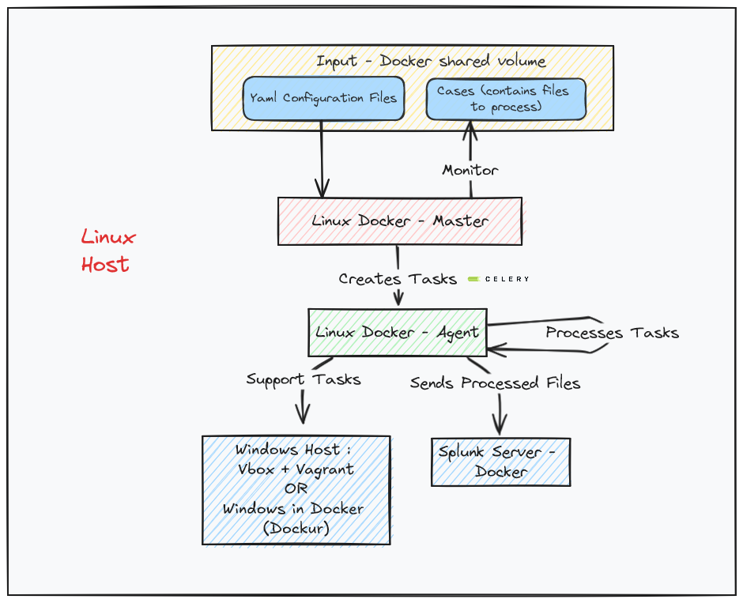
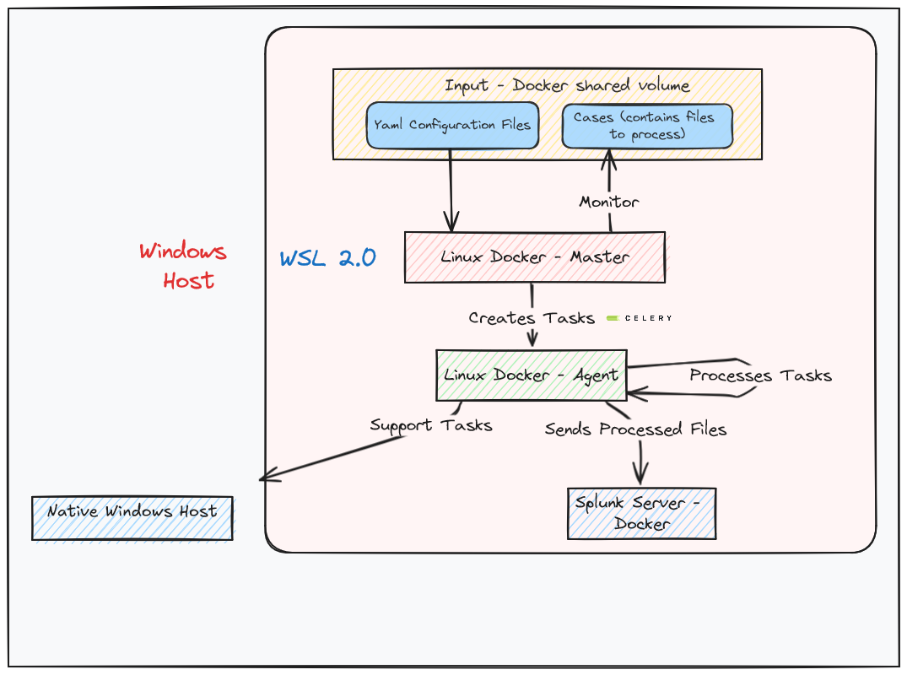

# OSIR

OSIR is a Python project designed for the automated processing of data using modules and profiles. It is primarily aimed at handling forensic artifacts but can be utilized for any type of files. OSIR acts as a scheduler, applying processing tools to files, where the output of some tools can serve as input to others.

OSIR is a dockerized and distributed parsing framework that works on Linux and Windows. The current project supports multiple triage outputs like DFIR ORC and UAC.


# Table of Contents
- [Architecture](#architecture)
- [How does it work ?](#how-does-it-work-)
- [Quick Start](#quick-start)
- [Contributing](#contributing)
- [Main features](#main-features)
- [Documentation](#documentation)
- [Currently supported modules](#currently-supported-modules)
- [Creators](#creators)
- [License](#license)

# Architecture

OSIR can be deployed in several ways, and each component can be externalized.

Here's the default “all in one” configuration:

<p align="center">
  
  
</p>

# How does it work ?

The goal of the tool is to transform input files using processors: **each processor is a module** (decompress archive, convert file to json, SIEM ingestion ...)

Modules are yml files that specify:
- **input** (file or directory) based on its file/directory path and/or name
- **output**: no file (ex: SIEM ingestion), single or multiple files
- **tool used and its command line**: Windows or Linux tool, can even be a Python module
- and other options to discover in the documentation
    
The tool itself is launched with 2 inputs:
- **a case**: directory containing files to process, can containg multiple triages (Windows triages of several endpoints for example)
- **list of modules** used to process the input files

Processing of case (**several cases can be processed in same time**):
- the master contains the case directory and continuously monitors for input that matches the selected modules
- each time a module matches an input, a task is added to the queue (output of a module can be input of another)
- the queue is processed by one or more agent 
- output of modules is written on the master storage


# Quick start

## Clone the project including dependencies

```bash
git clone --recurse-submodules https://github.com/maxspl/OSIR
```

## Example of usage: parsing DFIR ORC triage on Ubuntu host


# Main features

- Can run on Windows and Linux without any limitation
- Supports any type of input files
- Auto setup of Windows VM (via Windows in Docker or vBox) to use Windows tools on a linux Host
- Can process multiple triages at once 
- Distributed infrastructure: multiple endpoints can connect to distribute the load
- Dockerized installation
- Modular: processing tasks are defined by easily modifiable configuration files
- Splunk integration for output analysis


# Documentation

Project documentation: https://osir.readthedocs.io

# Supported Modules

| OS      | Filename                             | Description                                                                                                                             | Author         |   Version | Processor Type     | Tool Path                           |
|:--------|:-------------------------------------|:----------------------------------------------------------------------------------------------------------------------------------------|:---------------|----------:|:-------------------|:------------------------------------|
| generic | age_decrypt.yml                      | Used to decrypt age files. Don't forget to put the key in /OSIR/OSIR/configs/dependencies/encryption/key.age.                           | maxspl         |       1   | external           | age                                 |
| generic | indexer-ng.yml                       | Splunk logs ingestion (DFIR ORC and UAC) using module-specific json2splunk-rs configuration.                                            | maxspl         |       1   | internal           | json2splunk-rs                      |
| generic | mongodb.yml                          | Splunk logs ingestion of Mongodb logs.                                                                                                  | Typ            |       1   | external           | json2splunk-rs                      |
| generic | thor_lite.yml                        | Scan of collected file using Thor Lite.                                                                                                 | typ            |       1   | external           | thor-lite/thor-lite-linux-64        |
| generic | thor_orc.yml                         | Scan of collected DFIR ORC (output of restore_fs module) file using Thor (requires Forensic license).                                   | maxspl         |       1   | external           | thor/thor-linux-64                  |
| generic | thor_orc_ram.yml                     | Scan of RAM restored file system from MemProcFS using Thor (requires Forensic license).                                                 | maxspl         |       1   | external           | thor/thor-linux-64                  |
| generic | thor_uac.yml                         | Scan of collected UAC (output of extract_uac module) files using Thor (requires Forensic license).                                      | typ            |       1   | external           | thor/thor-linux-64                  |
| generic | thor_update.yml                      | Update Thor signature files using thor-util.                                                                                            | maxspl         |       1   | external           | thor/thor-util                      |
| network | zeek.yml                             | Parsing of pcap files using zeek                                                                                                        | maxspl         |       1   | external           | docker                              |
| unix    | arp.yml                              | Kelly Brazil - JsonConverter - Parsing the output of the command arp or arp -a                                                          | Kelly Brazil   |       1.1 | external           | cat                                 |
| unix    | audit.yml                            | Parsing logs from '/var/log/audit'                                                                                                      | Typ            |       1   | internal           |                                     |
| unix    | auth.yml                             | Parsing logs from '/var/log/auth.log'                                                                                                   | Typ            |       1   | internal           |                                     |
| unix    | blkid.yml                            | Kelly Brazil - JsonConverter - Parsing the output of the command blkid                                                                  | Kelly Brazil   |       1.1 | external           | cat                                 |
| unix    | boot.yml                             | Parsing logs from '/var/log/boot'                                                                                                       | Typ            |       1   | internal           |                                     |
| unix    | collect_info_uac.yml                 | Hash of DFIR UAC collected file                                                                                                         | maxspl         |       1   | external           | /usr/bin/find                       |
| unix    | cron.yml                             | Parsing logs from '/var/log/cron'                                                                                                       | Typ            |       1   | internal           |                                     |
| unix    | debug.yml                            | Parsing logs from '/var/log/debug'                                                                                                      | Typ            |       1   | internal           |                                     |
| unix    | df.yml                               | Kelly Brazil - JsonConverter - Parsing the output of the command df and df -h                                                           | Kelly Brazil   |       1.1 | external           | cat                                 |
| unix    | dmidecode.yml                        | Kelly Brazil - JsonConverter - Parsing the output of the command dmidecode                                                              | Kelly Brazil   |       1.1 | external           | cat                                 |
| unix    | dpkg-l.yml                           | Kelly Brazil - JsonConverter - Parsing the output of the command dpkg -l                                                                | Kelly Brazil   |       1.1 | external           | cat                                 |
| unix    | dpkg.yml                             | Parsing logs from '/var/log/dpkg'                                                                                                       | Typ            |       1   | internal           |                                     |
| unix    | env.yml                              | Kelly Brazil - JsonConverter - Parsing the output of the command env                                                                    | Kelly Brazil   |       1.1 | external           | cat                                 |
| unix    | extract_uac.yml                      | Used to execute internal pre-processing for Unix Artefact Collector Capture                                                             | Typ            |       1.1 | internal           | tar                                 |
| unix    | findmnt.yml                          | Kelly Brazil - JsonConverter - Parsing the output of the command findmnt                                                                | Kelly Brazil   |       1.1 | external           | cat                                 |
| unix    | free.yml                             | Kelly Brazil - JsonConverter - Parsing the output of the command free                                                                   | Kelly Brazil   |       1.1 | external           | cat                                 |
| unix    | ip_route.yml                         | Kelly Brazil - JsonConverter - Parsing the output of the command ip route                                                               | Kelly Brazil   |       1.1 | external           | cat                                 |
| unix    | iptables.yml                         | Kelly Brazil - JsonConverter - Parsing the output of the command iptables                                                               | Kelly Brazil   |       1.1 | external           | cat                                 |
| unix    | journal.yml                          | Parsing logs from '/var/log/journal/'                                                                                                   | Typ            |       1.1 | external           | journalctl                          |
| unix    | kernel.yml                           | Parsing logs from '/var/log/kernel'                                                                                                     | Typ            |       1   | internal           |                                     |
| unix    | last.yml                             | Kelly Brazil - JsonConverter - Parsing the output of the command last and lastb                                                         | Kelly Brazil   |       1.1 | external           | cat                                 |
| unix    | lastlog.yml                          | Parsing logs from '/var/log/lastlog'                                                                                                    | Typ            |       1   | internal           |                                     |
| unix    | lsblk.yml                            | Kelly Brazil - JsonConverter - Parsing the output of the command lsblk                                                                  | Kelly Brazil   |       1.1 | external           | cat                                 |
| unix    | lscpu.yml                            | Kelly Brazil - JsonConverter - Parsing the output of the command lscpu                                                                  | Kelly Brazil   |       1   | external           | cat                                 |
| unix    | lsmod.yml                            | Kelly Brazil - JsonConverter - Parsing the output of the command lsmod                                                                  | Kelly Brazil   |       1   | external           | cat                                 |
| unix    | lsusb.yml                            | Kelly Brazil - JsonConverter - Parsing the output of the command lsusb                                                                  | Kelly Brazil   |       1   | external           | cat                                 |
| unix    | mactime.yml                          | Parsing logs from '/bodyfile' in UAC collect                                                                                            | Typ            |       1   | external           | mactime                             |
| unix    | mail.yml                             | Parsing logs from '/var/log/mail'                                                                                                       | Typ            |       1   | internal           |                                     |
| unix    | message.yml                          | Parsing logs from '/var/log/message'                                                                                                    | Typ            |       1   | internal           |                                     |
| unix    | mount.yml                            | Kelly Brazil - JsonConverter - Parsing the output of the command mount                                                                  | Kelly Brazil   |       1   | external           | cat                                 |
| unix    | netstat.yml                          | Kelly Brazil - JsonConverter - Parsing the output of the command netstat                                                                | Kelly Brazil   |       1   | external           | cat                                 |
| unix    | nmcli.yml                            | Kelly Brazil - JsonConverter - Parsing the output of the command nmcli                                                                  | Kelly Brazil   |       1   | external           | cat                                 |
| unix    | postgresql.yml                       | Parsing logs from '/var/log/postgresql'                                                                                                 | Typ            |       1   | internal           |                                     |
| unix    | ps.yml                               | Kelly Brazil - JsonConverter - Parsing the output of the command ps and ps -ef                                                          | Kelly Brazil   |       1   | external           | cat                                 |
| unix    | snap.yml                             | Kelly Brazil - JsonConverter - Parsing the output of the command snap                                                                   | Kelly Brazil   |       1   | external           | cat                                 |
| unix    | sysctl.yml                           | Kelly Brazil - JsonConverter - Parsing the output of the command sysctl -a                                                              | Kelly Brazil   |       1   | external           | cat                                 |
| unix    | syslog.yml                           | Parsing logs from '/var/log/syslog'                                                                                                     | Typ            |       1   | internal           |                                     |
| unix    | systemctl_luf.yml                    | Kelly Brazil - JsonConverter - Parsing the output of the command systemctl list-unit-files                                              | Kelly Brazil   |       1   | external           | cat                                 |
| unix    | top.yml                              | Kelly Brazil - JsonConverter - Parsing the output of the command top and top -b                                                         | Kelly Brazil   |       1   | external           | cat                                 |
| unix    | uac_indexer.yml                      | Splunk logs ingestion (UAC) using json2splunk configuration from dependencies/uac_indexer_patterns.yml                                  | Typ            |       1   | external           | python                              |
| unix    | utmp.yml                             | Parsing logs from '/var/log/utmp btmp wtmp'                                                                                             | Typ            |       1   | internal           |                                     |
| unix    | vhdx.yml                             | Used to mount vhdx file system.                                                                                                         | typ            |       1   | external           | target-mount                        |
| unix    | vmstat.yml                           | Kelly Brazil - JsonConverter - Parsing the output of the command vmstat                                                                 | Kelly Brazil   |       1   | external           | cat                                 |
| unix    | web_access.yml                       | Parsing web access logs                                                                                                                 | maxspl         |       1   | external           | TurboLP                             |
| unix    | yum.yml                              | Parsing logs from '/var/log/yum'                                                                                                        | Typ            |       1   | internal           |                                     |
| windows | IIS.yml                              | Parse IIS from DFIR ORC restore_fs using Dissect plugin                                                                                 | maxspl         |       1   | internal           |                                     |
| windows | activities_cache.yml                 | Parse ActivitiesCache.db from DFIR ORC restore_fs using Dissect plugin                                                                  | maxspl         |       1   | internal           |                                     |
| windows | amcache.yml                          | Parsing of amcache artifact.                                                                                                            | maxspl         |       1.1 | external           | net9/AmcacheParser.exe              |
| windows | anssi_decode.yml                     | ANSSI tool designed for detecting anomalous Portable Executable (PE) files among the NTFSInfo data collected by DFIR-ORC                | maxspl         |       1   | internal           | machine_analysis                    |
| windows | authlog.yml                          | Parse auth log from UAC [root] using Dissect plugin                                                                                     | Typ            |       1   | internal           |                                     |
| windows | bash_history.yml                     | Parse bash history from UAC [root] using Dissect plugin                                                                                 | Typ            |       1   | internal           |                                     |
| windows | browsers.yml                         | Parsing of browsers artifact.                                                                                                           | maxspl         |       1   | external           | python                              |
| windows | collect_info_orc.yml                 | Hash of DFIR ORC collected file                                                                                                         | maxspl         |       1   | external           | /usr/bin/find                       |
| windows | dfir_orc_decrypt.yml                 | Used to decrypt age files. Don't forget to put the key in /OSIR/OSIR/configs/dependencies/encryption/DFIRORC_key.pem.                   | maxspl         |       1   | external           | orc-decrypt-rs                      |
| windows | dummy_external.yml                   | Dummy module to test WSL / Powershell connexion                                                                                         | maxspl         |       1   | external           | net9/AmcacheParser.exe              |
| windows | evtx.yml                             | Parsing of EVTX collected by DFIR ORC or in the filesystem                                                                              | maxspl         |       1.1 | external           | evtx_dump                           |
| windows | extract_orc.yml                      | Used to execute internal pre-processing for DFIR-ORC capture                                                                            | maxspl         |       1.1 | internal, external | 7zz                                 |
| windows | hayabusa.yml                         | Hayabusa scan of evtx files                                                                                                             | maxspl         |       1   | external           | hayabusa/hayabusa-3.0.1-lin-x64-gnu |
| windows | hives_hkcu.yml                       | Parsing of registry hives artifact.                                                                                                     | maxspl         |       1   | external           | net9/RECmd/RECmd.exe                |
| windows | hives_hklm.yml                       | Parsing of registry hives artifact.                                                                                                     | maxspl         |       1   | external           | net9/RECmd/RECmd.exe                |
| windows | indexer.yml                          | Splunk logs ingestion (DFIR ORC and UAC) using module-specific json2splunk configuration instead of dependencies/*_indexer_patterns.yml | maxspl         |       1   | internal           | python                              |
| windows | jump_list.yml                        | Parsing of jump list artifact.                                                                                                          | maxspl         |       1   | external           | net9/JLECmd.exe                     |
| windows | lnk.yml                              | Parsing of lnk artifact.                                                                                                                | maxspl         |       1   | external           | net9/LECmd.exe                      |
| windows | log2timeline_plaso.yml               | run log2timeline to create a Plaso storage file                                                                                         | maxspl         |       1   | external           | docker                              |
| windows | mft.yml                              | Parsing of $MFT artifact.                                                                                                               | Typ            |       1   | external           | net9/MFTECmd.exe                    |
| windows | orc_indexer.yml                      | plunk logs ingestion (ORC) using json2splunk configuration from dependencies/orc_indexer_patterns.yml                                   | maxspl         |       1   | external           | python                              |
| windows | orc_offline.yml                      | Used to execute DFIR ORC on dd capture                                                                                                  | maxspl         |       1   | external           | python.exe                          |
| windows | powershell_history.yml               | Parse ConsoleHost_history.txt                                                                                                           | maxspl         |       1   | internal           |                                     |
| windows | prefetch.yml                         | Eric Zimmerman - PECmd.exe                                                                                                              | Eric Zimmerman |       1   | external           | net9/PECmd.exe                      |
| windows | prefetch_orc.yml                     | Parse Prefetch                                                                                                                          | maxspl         |       1   | external           | net9/PECmd.exe                      |
| windows | pstree_live_response.yml             | Parse processes1.csv to produce pstree                                                                                                  | maxspl         |       1   | external           | python                              |
| windows | pstree_security.yml                  | Parse output of EVTX module to build process tree from security.evtx - event ID 4688                                                    | maxspl         |       1   | external           | python                              |
| windows | pstree_sysmon.yml                    | Parse output of EVTX module to build process tree from security.evtx - event ID 1                                                       | maxspl         |       1   | external           | python                              |
| windows | recycle_bin.yml                      | Parsing of recycle bin artifact.                                                                                                        | maxspl         |       1   | external           | net9/RBCmd.exe                      |
| windows | restore_fs.yml                       | Restore original filesystem structure from DFIR ORC triage                                                                              | maxspl         |       1   | external           | Restore_FS                          |
| windows | shell_bags.yml                       | Parsing of shell bags artifact.                                                                                                         | maxspl         |       1   | external           | net9/SBECmd.exe                     |
| windows | shimcache.yml                        | Parsing of ShimCache artifact.                                                                                                          | maxspl         |       1   | external           | net9/AppCompatCacheParser.exe       |
| windows | srum.yml                             | Parsing of SRUM artifact.                                                                                                               | maxspl         |       1   | external           | artemis                             |
| windows | test_process_dir.yml                 | description                                                                                                                             | maxspl         |       1   | external           | process_dir                         |
| windows | test_process_dir_multiple_output.yml | test_process_dir_multiple_output                                                                                                        | maxspl         |       1   | external           | process_dir_multiple_output         |
| windows | wer.yml                              | Parse .wer files                                                                                                                        | maxspl         |       1   | internal           |                                     |
| windows | win_arp_cache.yml                    | Parse arp_cache.txt from DFIR ORC (arp -a command)                                                                                      | maxspl         |       1   | internal           |                                     |
| windows | win_bits.yml                         | Parse BITS_jobs.txt from DFIR ORC (bitsadmin.exe /list /allusers /verbose command)                                                      | maxspl         |       1   | internal           |                                     |
| windows | win_dns_cache.yml                    | Parse dns_cache.txt from DFIR ORC (ipconfig.exe /displaydns command). Output fields lang depends on the system lang                     | maxspl         |       1   | internal           |                                     |
| windows | win_dns_records.yml                  | Parse DNS_records.txt from DFIR ORC (custom ps1 command)                                                                                | maxspl         |       1   | internal           |                                     |
| windows | win_enumlocs.yml                     | Parse Enumlocs.txt from DFIR ORC                                                                                                        | maxspl         |       1   | internal           |                                     |
| windows | win_handle.yml                       | Parse handle from DFIR ORC (handle.exe /a command)                                                                                      | maxspl         |       1   | internal           |                                     |
| windows | win_listdlls.yml                     | Parse Listdlls.txt from DFIR ORC (Listdlls.exe command)                                                                                 | maxspl         |       1   | internal           |                                     |
| windows | win_memory.yml                       | Parsing of Windows memory dump.                                                                                                         | maxspl         |       1.1 | internal, external | memprocfs/memprocfs                 |
| windows | win_netstat.yml                      | Parse netstat.txt from DFIR ORC (netstat.exe -a -n -o command)                                                                          | maxspl         |       1   | internal           |                                     |
| windows | win_routes.yml                       | Parse routes.txt from DFIR ORC (route.exe PRINT command)                                                                                | maxspl         |       1   | internal           |                                     |
| windows | win_tcpvcon.yml                      | Parse routes.txt from DFIR ORC (Tcpvcon.exe -a -n -c command)                                                                           | maxspl         |       1   | internal           |                                     |
| windows | win_timeline.yml                     | Parsing of Windows Timeline (ActivitiesCache.db) artifact. Tool from Nihith (https://github.com/bolisettynihith/ActivitiesCacheParser)  | maxspl         |       1.1 | external           | python                              |
| windows | win_wmi_eventconsumer.yml            | Parse EventConsumer.txt from DFIR ORC (powershell.exe Get-WMIObject -Namespace root\Subscription -Class __EventConsumer command)        | maxspl         |       1   | internal           |                                     |    |                                     |

# Contributing

All contributions are welcome! Don't hesitate to report any bugs or problems you encounter with the framework. To contribute, please follow this [guide](https://github.com/firstcontributions/first-contributions)

# Creators

**Typ ❤️** 

- https://github.com/Typ-ix

# License

The project uses the following third-party libraries (If we forget anything, please let us know.) 

| Name                      | Version | License                                                 | URL                                                  |
|---------------------------|---------|---------------------------------------------------------|------------------------------------------------------|
| PyYAML                    | 5.4.1   | MIT License                                             | https://pyyaml.org/                                  |
| celery                    | 5.4.0   | BSD License                                             | https://docs.celeryq.dev/                            |
| chardet                   | 5.2.0   | GNU LGPLv2+                                             | https://github.com/chardet/chardet                   |
| flower                    | 2.0.1   | BSD License                                             | https://github.com/mher/flower                       |
| lz4                       | 4.3.3   | BSD License                                             | https://github.com/python-lz4/python-lz4             |
| mpire                     | 2.10.2  | MIT License                                             | https://github.com/sybrenjansen/mpire                |
| pandas                    | 2.2.2   | BSD License                                             | https://pandas.pydata.org                            |
| polars                    | 1.3.0   | MIT License                                             | https://www.pola.rs/                                 |
| psutil                    | 6.0.0   | BSD License                                             | https://github.com/giampaolo/psutil                  |
| puremagic                 | 1.26    | MIT License                                             | https://github.com/cdgriffith/puremagic              |
| pywinrm                   | 0.4.3   | MIT License                                             | http://github.com/diyan/pywinrm/                     |
| redis                     | 5.0.4   | MIT License                                             | https://github.com/redis/redis-py                    |
| smbprotocol               | 1.13.0  | MIT License                                             | https://github.com/jborean93/smbprotocol             |
| streamlit                 | 1.37.0  | Apache Software License                                 | https://streamlit.io                                 |
| tqdm                      | 4.66.4  | MIT License; MPL 2.0                                    | https://tqdm.github.io                               |
| watchdog                  | 4.0.1   | Apache Software License                                 | https://github.com/gorakhargosh/watchdog             |
| RECmd                     | 1.1.0.0 | MIT License                                             | https://github.com/EricZimmerman/RECmd               |
| MFTECmd                   | 1.3.0.0 | MIT License                                             | https://github.com/EricZimmerman/MFTECmd             |
| WxTCmd                    | 0.5.0.0 | MIT License                                             | https://github.com/EricZimmerman/WxTCmd              |
| LECmd                     | 1.0.0.0 | MIT License                                             | https://github.com/EricZimmerman/LECmd               |
| AppCompatCacheParser      | 0.9.0.0 | MIT License                                             | https://github.com/EricZimmerman/AppCompatCacheParser|
| PECmd                     | 1.5.0.0 | MIT License                                             | https://github.com/EricZimmerman/PECmd               |
| AmcacheParser             | 0.9.0.0 | MIT License                                             | https://github.com/EricZimmerman/AmcacheParser       |
| JLECmd                    | 0.5.0.0 | MIT License                                             | https://github.com/EricZimmerman/JLECmd              |
| RBCmd                     | 0.8.0.0 | MIT License                                             | https://github.com/EricZimmerman/RBCmd               |
| SrumECmd                  | 0.3.0.0 | MIT License                                             | https://github.com/EricZimmerman/SrumECmd            |
| RecentFileCacheParser     | 0.4.0.0 | MIT License                                             | https://github.com/EricZimmerman/RecentFileCacheParser|
| evtx_dump                 | 0.8.3   | MIT License                                             | https://github.com/omerbenamram/evtx                 |
| 7z                        | 24.07   | GNU LGPL                                                | https://7-zip.org/                                   |
| Artemis                   | 1.1     | MIT license                                             | https://github.com/puffyCid/artemis                  |
| Splunk                    | latest  | Splunk Software License Agreement                       | https://www.splunk.com                               |
| PostgreSQL                | latest  | PostgreSQL License                                      | https://www.postgresql.org/                          |
| SA-ADTimeline             | 1.0     | GPL-3.0 license                                         | https://github.com/ANSSI-FR/ADTimeline               |
| DECODE                    | 1.0     | BSD-3-Clause license                                    | https://github.com/ANSSI-FR/DECODE                   |

# Other references

- GOAD installations scripts: https://github.com/Orange-Cyberdefense/GOAD
- DFIR ORC: https://github.com/dfir-orc
- UAC: https://github.com/tclahr/uac
- Splunk TA EVTX DUMP : https://github.com/ZikyHD
- Windows inside docker : https://github.com/dockur/windows
- Vagrant box : https://portal.cloud.hashicorp.com/vagrant/discover/StefanScherer/windows_10
