OSIR basics 
=============

Overview
--------

OSIR is a Python project designed for the automated processing of data using modules and profiles. It is primarily aimed at handling forensic artifacts but can be utilized for any type of files. OSIR acts as a scheduler, applying processing tools to files, where the output of some tools can serve as input to others.

Features
--------

- **Modular Design**: Easily integrate new tools without writing code by using YAML configuration files.
- **Containerized**: Fully containerized architecture for seamless deployment and management.
- **WebUI**: Integrates an optional web UI to manages processing jobs.
- **Multi-OS**: OSIR can run on Windows via WSL2 and on a Linux host. 

Components & Terminology
------------------------

- **Master**: Monitors a directory (called "case") containing files to be processed and creates processing tasks for the agents.
- **Agent**: Processes tasks issued by the master and interacts with other components like the Windows machine or Splunk depending on the tasks.
- **Splunk (Optional)**: Can be deployed locally on the same host as the master or remotely.
- **Windows Box (Optional)**: Can be deployed locally on the same host as the master or remotely. Two ways of deploying automatically a Windows VM are currently supported: using vbox and Vagrant or using Dockur (Windows in Docker). If running OSIR agent on a Windows host, there is no need to deploy a Windows VM, the host itself is used.
- **Processing job**: Action of processing a case containing files to process. Handled by master.
- **Processing tasks**: Processing action decribed by a module configuration file, taking in input a directory or file and applying. Handled by agents.

Architectures
-------------

.. note:: The architectures depicted below can be mixed and adapted to fit your needs. For example, you can deploy multiple agents, use a single Windows box for several agents, and more.

All in one - LINUX HOST
***********************

.. image:: _img/All-in-one_.png
   :alt: All in one Architecture

All in one - WINDOWS HOST
*************************

.. image:: _img/all-in-one-windows.png
   :alt: All in one Architecture

Distributed agents
******************

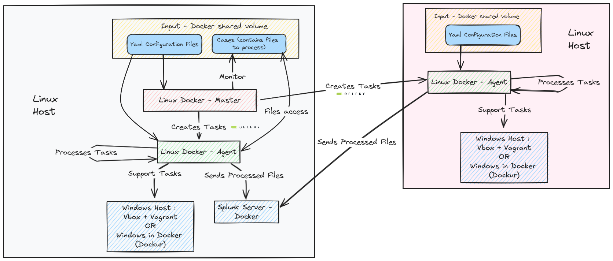

External Splunk and Windows hosts
*********************************

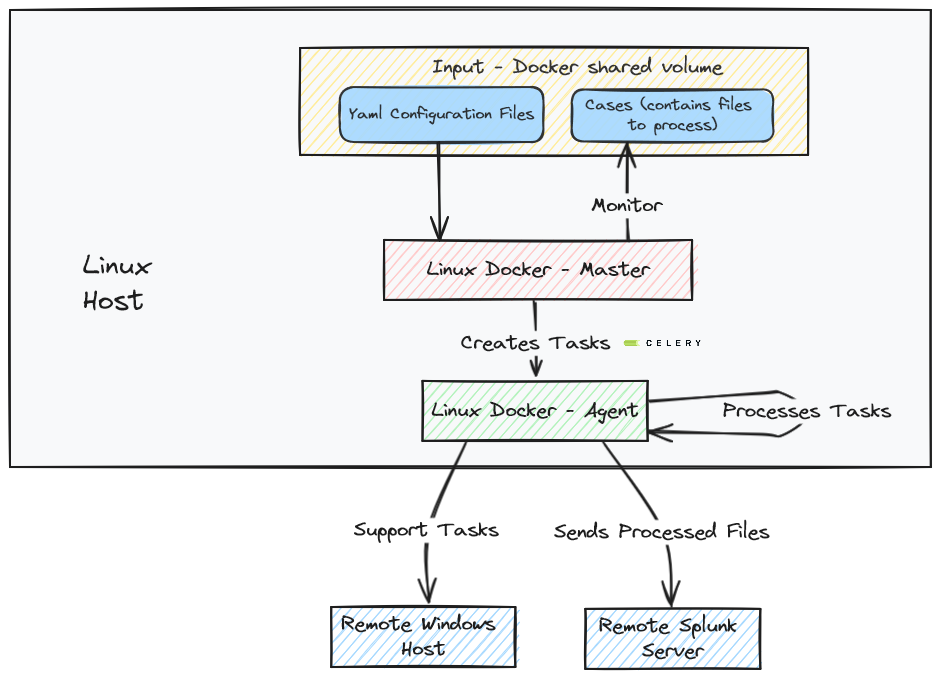

Network flows
-------------

All in one host
***************

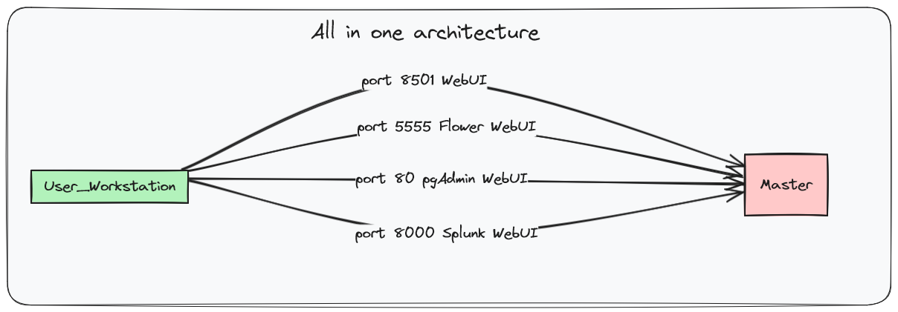

External agent and remote Windows box
*************************************

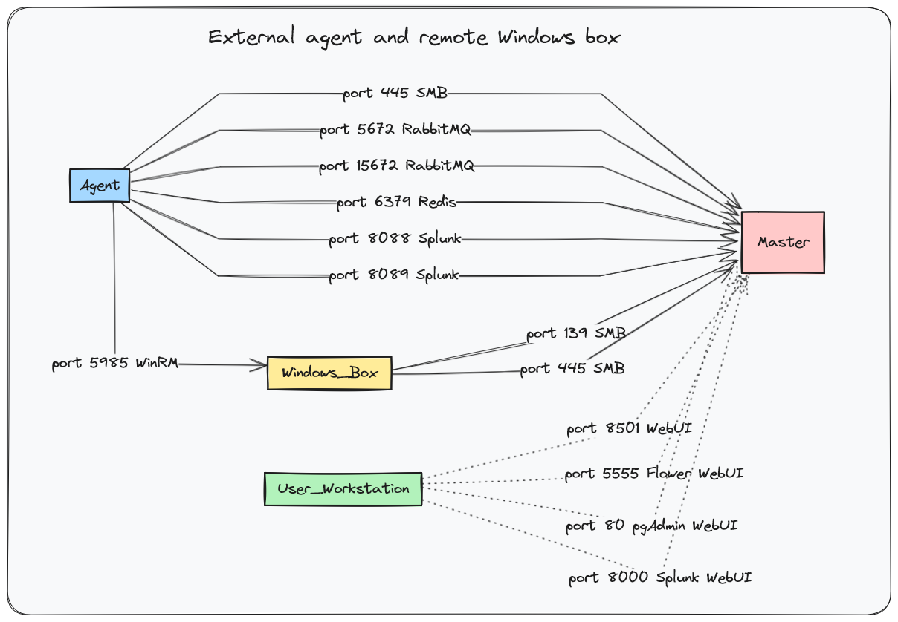

External agent, remote Windows box and external Splunk
******************************************************

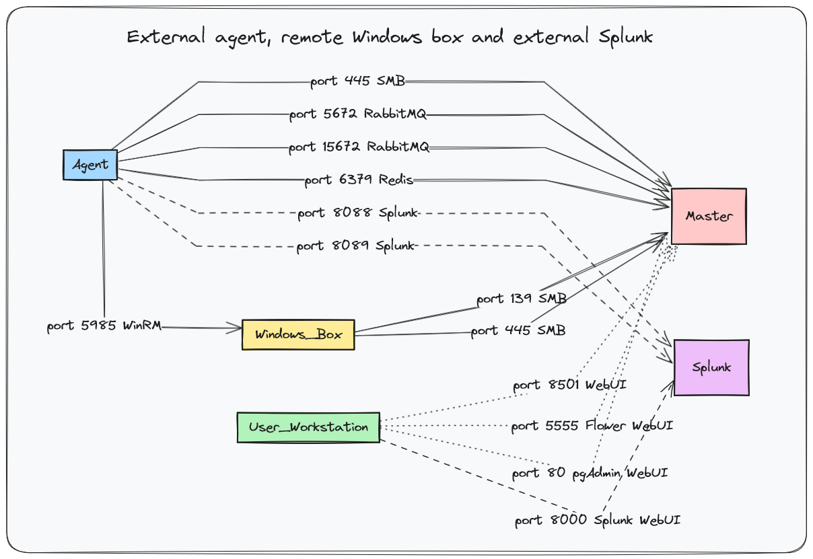

   
Getting Started
---------------

Prerequisites
*************

Use Case 1
^^^^^^^^^^

You have a Linux host (not a VM) and you need everything to run on this single machine.

Theses requirements are needed:

- Docker
- Docker Compose
- If you need to run Windows tools, there are 3 possibilities:
   - OSIR sets up a VM with Vbox and Vagrant automatically, so you need :
      - Vagrant (installed automatically if needed) 
      - Virtual Box (installed automatically if needed)
      - Enough disk space for a Windows VM (50GB)
   - OSIR sets up a VM in Docker (Dockur project), so you only need dockur and around 30GB of disk space
   - You already have a Windows VM, so you need :
      - An admin account
      - Winrm enabled
- Networks flows described in the nexts sections

Use Case 2
^^^^^^^^^^

You have a Windows host (not a VM) and you need everything to run on this single machine.

.. warning:: OSIR can be used on Windows system for all in one mode (server and agent on the same machine) and agent mode but not in server mode for distributed architecture.

Theses requirements are needed:

- WSL 2
- Docker installed in your WSL 2 VM
- Docker Compose installed in your WSL 2 VM
- Linux host
- Networks flows described in the nexts sections

Use Case 3
^^^^^^^^^^

You have want to setup a distribued architecture with a server and multiples agent.
- OSIR server can installed on a Linux host, even a VM but not in WSL
- If you need to run Windows tools, each agent must have a Windows box configured, a single box reachable from each VM can be used.
- Networks flows described in the nexts sections

.. warning:: Only basic use cases are described but OSIR can be configured in many other ways.

All in one deployment
*********************

This guided example will demonstrate how to setup the solution and how to use it.
For the example, **All in one architecture** is used.

Clone the repository:

.. code-block:: bash

    git clone --recurse-submodules https://github.com/maxspl/OSIR.git

Network requirements
********************

.. important:: Make sure that the following ports are not currently in use :

    - 80: pgadmin to administrate the postgres Database
    - 5432: postgres Database
    - 5672: AMQP protocol
    - 15672: rabbitmq Management interface
    - 6379: Reddis
    - 5555: Flower
    - 139: SMB used to access file from Windows box or remote agent
    - 445: SMB used to access file from Windows box or remote agent
    - 8501: Main Web interface
    - 8000: Splunk web interface
    - 8089: Splunk services interface
    - 9997: Splunk event listening port
    - 8088: HEC port for Splunk event forwarding
    - 8502: FastAPI

OSIR Launcher
*************

OSIR now uses a unified launcher named ``osir-launcher.py``.
This tool replaces previous bash scripts and manual container commands.

Display global help:

.. code-block:: bash

    python3 osir-launcher.py -h

Example output:

.. code-block:: console

    usage: osir-launcher.py [-h] {start,stop,status} ...

    Unified OSIR launcher.

    positional arguments:
      {start,stop,status}
        start              Install and start components
        stop               Stop master or agent
        status             Show OSIR status
        airgap             Air-gapped workflow (export/load docker images)

Commands Overview
^^^^^^^^^^^^^^^^^

- **start** : Install and launch OSIR components
- **stop** : Stop running components
- **status** : Check if OSIR processes are running inside containers
- **airgap** : Export docker images to prepare offline setup and load them afterwards

You can also view help for the start command:

.. code-block:: bash

    python3 osir-launcher.py start -h

Which displays:

.. code-block:: console

    usage: osir-launcher.py start [-h] {master,agent,all} ...

      master   Install and start the MASTER component
      agent    Install and start the AGENT component
      all      Install and start both MASTER and AGENT

All-in-one installation and start
*********************************

OSIR can be installed and started in a single command using the launcher.

.. code-block:: bash

    cd OSIR
    sudo python3 osir-launcher.py start all

This command will:

- Install MASTER and AGENT if not already configured
- Start required containers
- Launch OSIR processes automatically

.. warning::
   The first execution can take time because Docker images,
   dependencies, and the Windows VM for the Agent may be downloaded.

Checking OSIR status
********************

You can verify if OSIR components are running with:

.. code-block:: bash

    python3 osir-launcher.py status

The launcher prints an overview table and performs two checks per component:

1. **Container check**: verifies the Docker container is running
2. **Process check**: verifies the expected OSIR process is running inside the container

Expected processes inside containers:

- ``master-master`` must run ``OSIR.py --web``
- ``agent-agent`` must run ``OSIR.py --agent``

Status meanings
^^^^^^^^^^^^^^^

**UP ✅**
  The container is running and the expected OSIR process is running inside it.

**DOWN ❌ (container not running)**
  Example:

  .. code-block:: console

      Agent process check  : DOWN ❌ (container not running. Start it using OSIR_launcher.py start command)

  This means Docker containers are not up yet (or were stopped).
  Start everything again with:

  .. code-block:: bash

      sudo python3 osir-launcher.py start all

**DOWN ❌ (process not running inside container)**
  Example:

  .. code-block:: console

      Master process check : DOWN ❌ (start master using OSIR.py --web inside master-master container)
      Agent process check  : DOWN ❌ (start agent using OSIR.py --agent inside agent-agent container)

  This means containers are running, but the OSIR processes inside are not.
  The recommended fix is to restart using the launcher:

  .. code-block:: bash

      sudo python3 osir-launcher.py start all

Usage
*****

From Unix host
^^^^^^^^^^^^^^

Create a directory (referenced as a 'case' in the documentation) under OSIR/share/cases/:

.. code-block:: bash

    mkdir OSIR/share/cases/my_first_case

Copy the files you want to process under OSIR/share/cases/<case name>

.. code-block:: bash

    cp /tmp/DFIR-ORC_WorkStation_DESKTOP-BV01_Browsers.7z OSIR/share/cases/my_first_case
    cp /tmp/DFIR-ORC_WorkStation_DESKTOP-BV01_General.7z OSIR/share/cases/my_first_case
    cp /tmp/DFIR-ORC_WorkStation_DESKTOP-BV01_Powershell.7z OSIR/share/cases/my_first_case
    cp /tmp/DFIR-ORC_WorkStation_DESKTOP-BV01_SAM.7z OSIR/share/cases/my_first_case
    cp /tmp/DFIR-ORC_WorkStation_DESKTOP-BV02_Browsers.7z OSIR/share/cases/my_first_case
    cp /tmp/DFIR-ORC_WorkStation_DESKTOP-BV02_General.7z OSIR/share/cases/my_first_case
    cp /tmp/DFIR-ORC_WorkStation_DESKTOP-BV02_Powershell.7z OSIR/share/cases/my_first_case
    cp /tmp/DFIR-ORC_WorkStation_DESKTOP-BV02_SAM.7z OSIR/share/cases/my_first_case

At this step, master and agent should be running.

Access the web UI and run the processing

Use a defined profile or select several modules

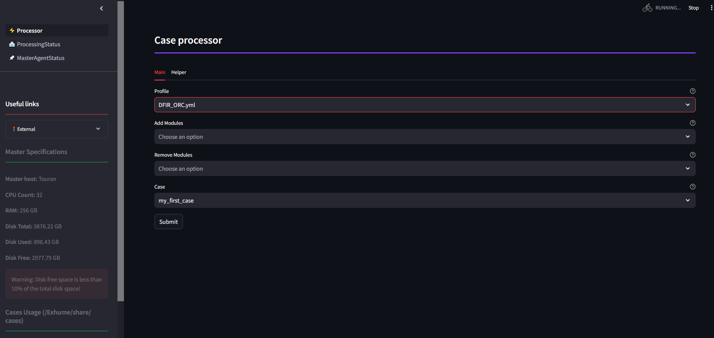

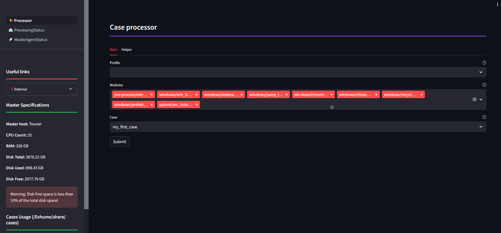

The processing tasks can be followed in ProcessingStatus pages:

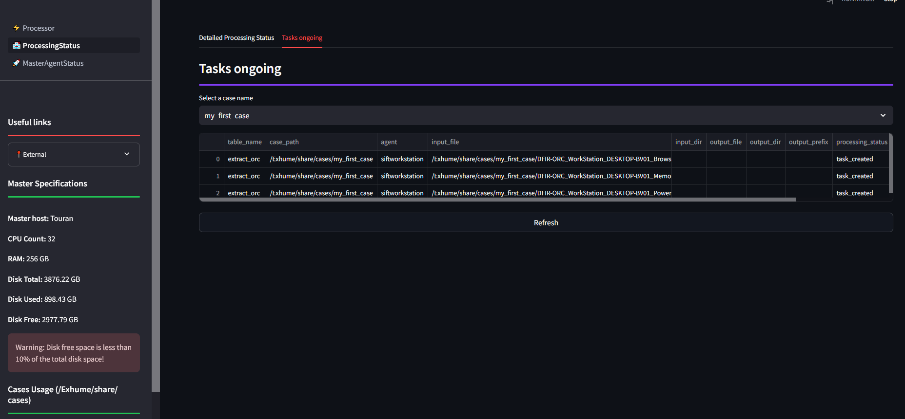

The processing job can be followed in MasterAgentStatus page:

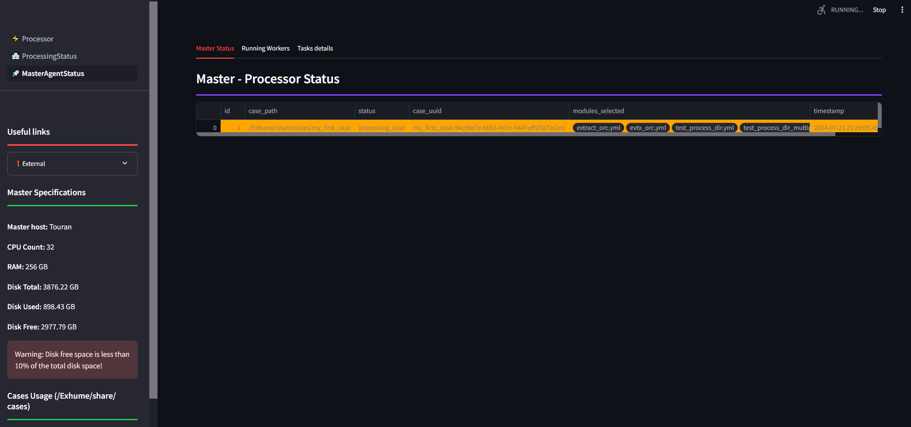

From Windows host
^^^^^^^^^^^^^^^^^

DFIR ORC triage

To parse a DFIR_ORC collection, create a new case, upload the DFIR_ORC archive and run either the chosen profile or a specific module: 

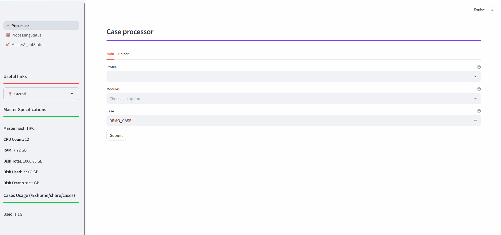

UAC triage

To parse a UAC collection, create a new case, upload the UAC archive and run either the chosen profile or a specific module: 

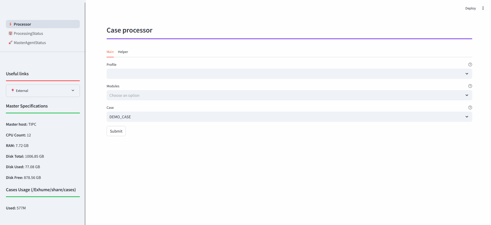

Stopping OSIR
*************

OSIR components can be stopped using the launcher ``osir-launcher.py``.

Show stop command help:

.. code-block:: bash

    python3 osir-launcher.py stop -h

Stop MASTER
^^^^^^^^^^^

Stop the MASTER stack:

.. code-block:: bash

    sudo python3 osir-launcher.py stop master

Optional flags:

- **-i / --images**: also remove docker images related to MASTER.

.. code-block:: bash

    sudo python3 osir-launcher.py stop master --images

Stop AGENT
^^^^^^^^^^

Stop the AGENT stack:

.. code-block:: bash

    sudo python3 osir-launcher.py stop agent

Optional flags:

- **-v / --vagrant**: also stop the Vagrant Windows VM (if used by the agent).
- **-d / --dockur**: also stop Dockur-related services (if enabled/used).
- **-i / --images**: also remove docker images related to AGENT.

Examples:

.. code-block:: bash

    sudo python3 osir-launcher.py stop agent --vagrant
    sudo python3 osir-launcher.py stop agent --dockur
    sudo python3 osir-launcher.py stop agent --images