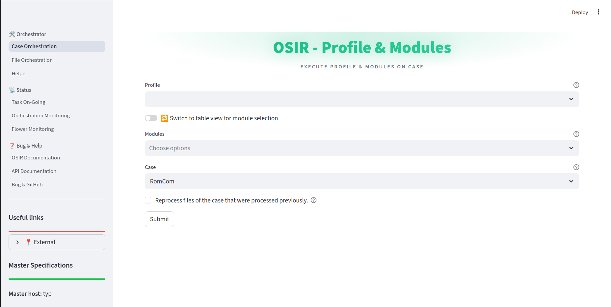
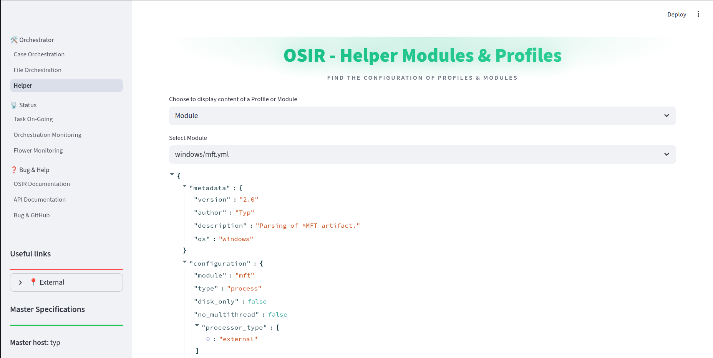
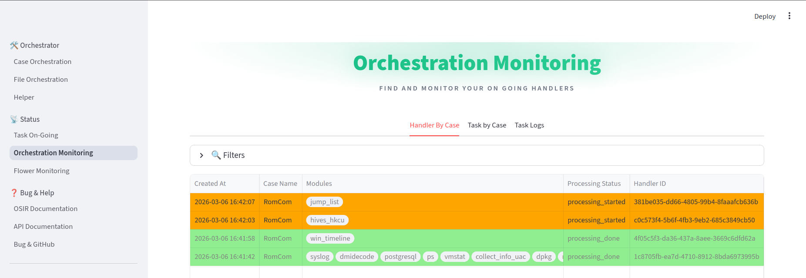
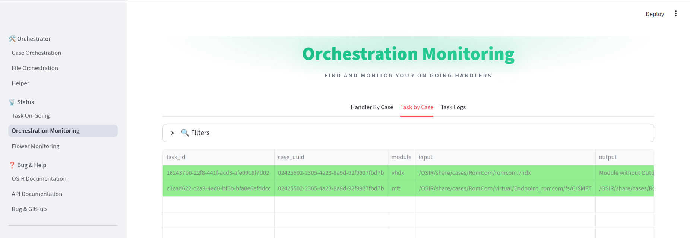
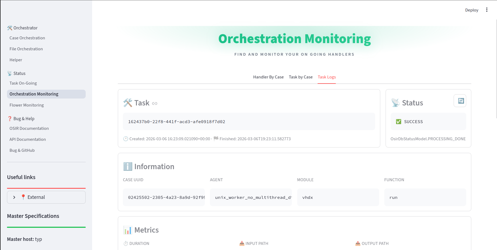

Web Usage
=============================

.. contents:: Table of Contents
   :depth: 2
   :local:
   :backlinks: none

----

Orchestrator Actions
--------------------

Case Orchestration
^^^^^^^^^^^^^^^^^^

The Case Orchestration module allows users to execute profiles and modules on specific cases. Each execution creates a handler.
A handler is defined by the OsirDbHandlerModel class in the osir_service/postgres/model directory. It contains:

- The list of executed modules
- The list of tasks generated by the master process

**Available Actions:**

- **Profile Selection** — Choose from existing profiles to execute predefined sets of modules.
- **Module Selection** — Select individual modules to execute on a case.
- **Module Management** — Add or remove modules from selected profiles.
- **Module Configuration** — Edit module configuration using a YAML editor.
- **Case Selection** — Choose the target case directory for processing.
- **Reprocessing** — Option to reprocess previously processed files.
- **Execution** — Submit the selected profile/modules for execution on the chosen case.

File Orchestration
^^^^^^^^^^^^^^^^^^

The File Orchestration module provides a file explorer interface for executing modules on specific files or folders. Each execution create only a task and not a handler.

**Available Actions:**

- **File Exploration** — Browse the case directory structure.
- **File Operations:**

  - View file content (first 5 lines preview)
  - Download files
  - View task logs associated with files

- **Module Execution:**

  - Run modules on individual files
  - Run modules on all files within a directory

- **Search and Navigation** — Search for specific files or directories.
- **Tree View** — Expand/collapse the directory tree for easy navigation.

**Exemple:**

Windows & Linux module execution through WebUi : 

.. video:: _img/file_orchestration.webm
   :alt: File Orchestration demo
   :width: 100%
   :autoplay:
   :loop:
   :muted:
   :nocontrols:

Helper
^^^^^^

The Helper module provides auxiliary functions for viewing configuration details.

**Available Actions:**

- **Profile Viewer** — View the YAML configuration of any profile.
- **Module Viewer** — View the YAML configuration of any module.
- **Configuration Inspection** — Examine the structure and parameters of profiles and modules.

----

Status Monitoring Actions
--------------------------

Task On-Going
^^^^^^^^^^^^^

The Task On-Going module provides real-time monitoring of currently executing tasks.

**Available Actions:**

- **Task Listing** — View all tasks with ``task_created`` or ``processing_started`` status.
- **Task Details** — Click on any task to view detailed information.
- **Task Monitoring** — Automatically switch to detailed monitoring view when selecting a task.
- **Status Filtering** — View tasks filtered by processing status.

Orchestration Monitoring
^^^^^^^^^^^^^^^^^^^^^^^^

The Orchestration Monitoring module provides comprehensive monitoring of handlers and tasks.

**Handler Monitoring:**

- View all handlers by case
- Filter handlers by case name and processing status
- View handler details including associated task IDs
- Delete handlers and their associated tasks
- Clear all database entries for a specific case

**Task Monitoring:**

- View all tasks associated with a case
- Filter tasks by handler ID, module, and processing status
- View detailed task information including execution traces
- Download task logs
- Rerun failed or completed tasks

**Task Log Viewing:**

- View detailed execution logs for specific tasks
- View task metrics and timing information
- Download complete log files

Flower Monitoring
^^^^^^^^^^^^^^^^^

The Flower Monitoring module provides monitoring of Celery workers and tasks.

**Available Actions:**

- **Worker Monitoring** — View status of all Celery workers (online/offline).
- **Task Details** — View detailed task information through the Flower web interface.
- **Worker Management** — Monitor worker health and availability.

.. image:: _img/flower_monitoring.gif
   :alt: Flower Monitoring